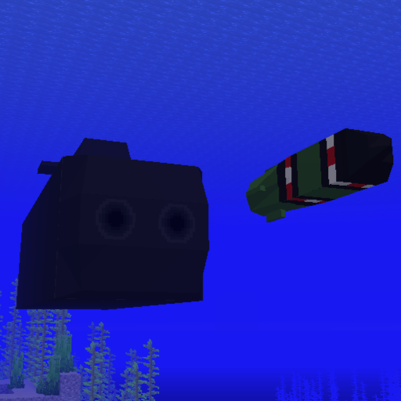

  

  # Submarines'n Torpedoes

  **Dive into underwater combat with fully functional submarines, homing torpedoes, and tactical sonar warfare.**

  
  

---

## Overview

Minecraft's oceans have been waiting for this. **Submarines'n Torpedoes** transforms underwater gameplay with realistic submarine mechanics, torpedo warfare, and sonar detection. Navigate the depths in fully 3D-modeled submarines, engage in tactical combat, and explore ocean biomes like never before.

## Features

### ⚓ Submarines

Pilot fully functional submarines through ocean depths. Submarines feature multiple movement modes for different situations - silent running for stealth, cruise for balanced travel, or flank speed when speed matters most. Power management is key; submarines consume fuel to operate, requiring careful resource planning during long expeditions. Passengers inside remain safe from drowning and hostile mobs.

### 🚀 Torpedoes

Fire guided torpedoes that autonomously track and destroy targets. Torpedoes feature intelligent homing systems that lock onto enemies within their detection range. Multiple targeting modes allow precise control over what gets tracked. The arming delay prevents close-range accidents, while the long range enables strategic strikes from a distance.

### 📡 Sonar

Detect nearby threats and terrain with active sonar scanning. The sweeping radar display reveals submarines, players, mobs, and underwater obstacles in all directions. Each sonar ping consumes power, creating tactical decisions between information gathering and resource management. Contacts fade over time, requiring periodic scans to maintain awareness.

### 🔧 Manufacturing Table

Craft submarines, torpedoes, and components at a specialized crafting station. The Manufacturing Table provides recipes for all submarine-related items, from complete vehicles to individual components and repair tools.

### 🛠️ Repair System

Keep submarines operational with repair tools. Submarines take damage from explosions and require maintenance to stay combat-effective. The Submarine Repair Tool restores health to damaged vessels.

---

## For Developers

**Submarines'n Torpedoes** provides a comprehensive API for creating custom content:

- Custom submarines with unique stats and behaviors
- New torpedo variants with different characteristics
- Custom 3D models and textures
- Manufacturing Table recipes for custom items

See **[API.md](https://github.com/rizen211/submarinesn-torpedoes/blob/master/API.md)** for complete documentation, examples, and best practices.

---

## Credits

**Models:** Created in Blockbench, triangulated with MTools plugin by Malik12tree

---

  Built with Fabric API • Requires Java 21

